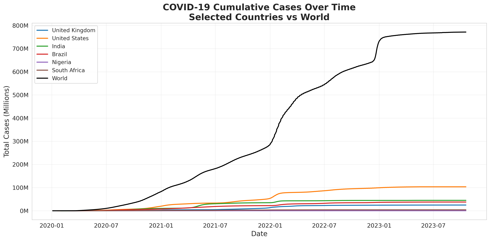
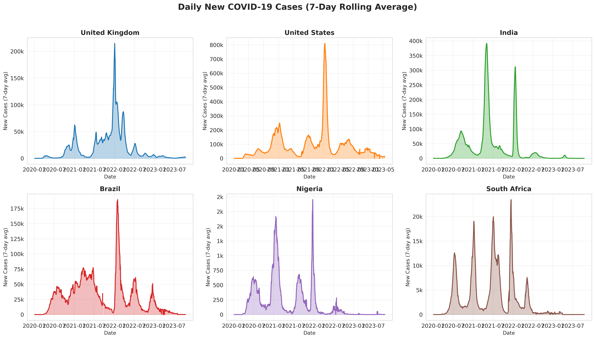
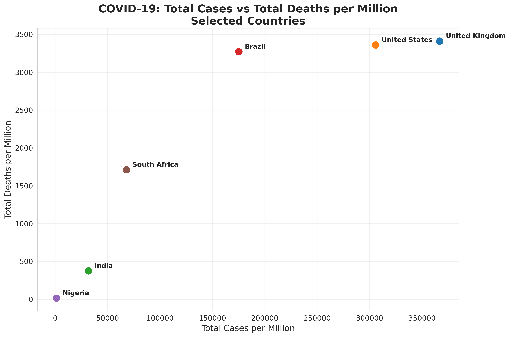
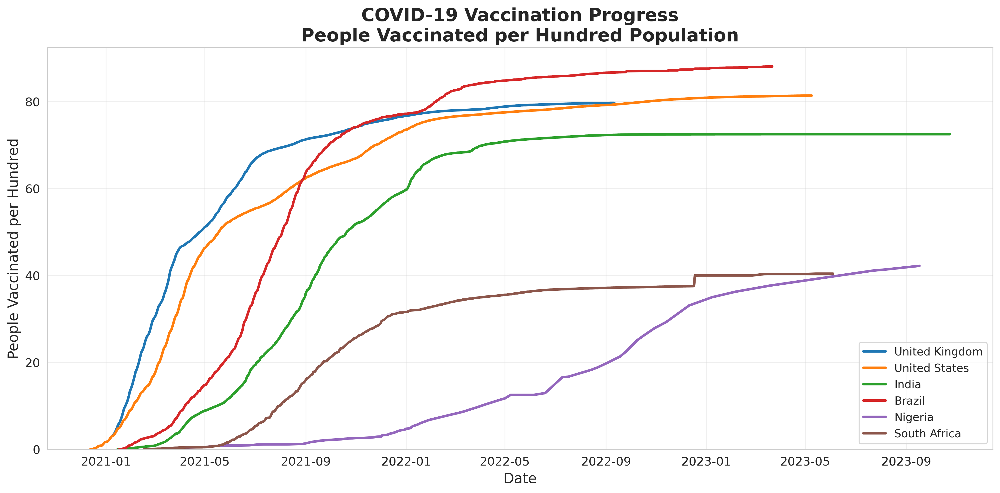
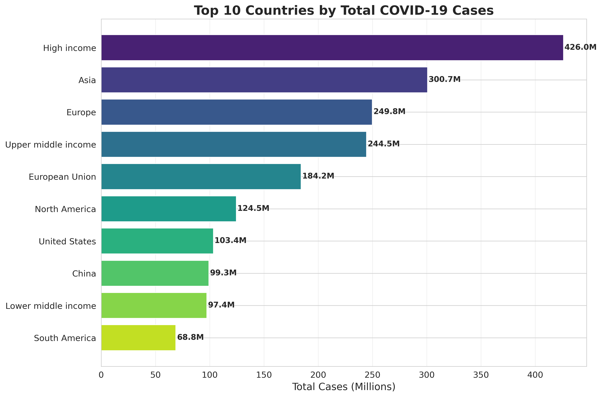

# COVID-19 Global Analysis: Trends in Cases, Deaths, and Vaccinations

**Analyst:** Oluwasijibomi Oderinde  
**Date:** April 2026  
**Tools:** Python (pandas, NumPy, Matplotlib, Seaborn), Jupyter Notebook (Google Colab)

---

## Executive Summary

This analysis examines global COVID-19 data from the Our World in Data repository, covering the period from January 2020 to present. The objective was to identify temporal trends, compare outcomes across selected countries, and visualize the relationship between cases, deaths, and vaccination progress.

**Key Findings:**
- The United States, India, and Brazil lead globally in cumulative case counts, with each exceeding 40 million total cases.
- Vaccination rates vary significantly, with the United Kingdom achieving over 80% partial vaccination while Nigeria and South Africa remain below 40%.
- A clear positive correlation exists between total cases per million and total deaths per million across countries, though mortality rates differ due to healthcare infrastructure and demographic factors.
- All selected countries experienced multiple distinct pandemic waves, visible through 7-day rolling average analysis.

**Deliverables:**
- Five publication-ready visualizations (line charts, scatter plots, bar charts)
- Cleaned dataset for selected countries (United Kingdom, United States, India, Brazil, Nigeria, South Africa)
- Fully documented Python notebook with reproducible analysis

---

## Business Context

Understanding pandemic progression and country-level outcomes is essential for public health planning, resource allocation, and policy evaluation. This analysis provides a data-driven overview of how COVID-19 affected different regions, with particular attention to Nigeria and South Africa alongside global leaders.

---

## Data Sources

**Source:** Our World in Data COVID-19 Dataset  
**Repository:** https://github.com/owid/covid-19-data  
**License:** Creative Commons Attribution 4.0 International (CC BY 4.0)

**Dataset Description:**
- Comprehensive daily-updated dataset covering cases, deaths, testing, vaccinations, and hospitalizations for all countries.
- Over 300,000 rows and 67 columns in the full dataset.

**Time Period Analyzed:** January 2020 – April 2026

**Acknowledged Limitations:**
- Reporting standards and testing capacity vary significantly by country, affecting case count accuracy.
- Vaccination data is incomplete for some countries and time periods.
- The dataset aggregates national data and does not capture subnational variation.

---

## Repository Structure

---

## Data Processing Methodology

### Python (pandas, NumPy)

The analysis was conducted in Google Colab using Python 3. Key processing steps included:

- **Data Loading:** Imported 87.6 MB CSV file using pandas.
- **Country Selection:** Filtered dataset to six countries of interest plus world aggregate.
- **Date Conversion:** Converted date strings to datetime objects for time-series analysis.
- **Rolling Averages:** Calculated 7-day rolling means for daily new cases to smooth reporting anomalies.
- **Aggregation:** Computed latest values and mortality rates for comparative analysis.

**Notebook:** `covid19_analysis.ipynb`

---

## Key Findings and Supporting Visualizations

### Finding 1: Cumulative Cases Show Divergent Trajectories

The United States leads in cumulative cases, followed by India and Brazil. Nigeria and South Africa show substantially lower case counts, though this may partially reflect testing limitations.

**Strategic Implication:** Case count comparisons must be contextualized with testing rates and population size. Per-capita metrics provide more meaningful cross-country comparisons.

---

### Finding 2: Multiple Pandemic Waves Visible Across All Countries

All selected countries experienced distinct waves of infection, visible through 7-day rolling average smoothing. Wave timing and magnitude varied by region.

**Strategic Implication:** Understanding wave periodicity can inform healthcare surge capacity planning and timing of public health interventions.

---

### Finding 3: Cases and Deaths Are Positively Correlated

A clear positive relationship exists between total cases per million and total deaths per million. However, mortality rates vary, with South Africa showing a higher rate (2.07%) compared to India (1.21%).

**Mortality Rates (Deaths per 100 cases):**
| Country | Mortality Rate |
|---------|---------------|
| South Africa | 2.07% |
| Brazil | 1.89% |
| United Kingdom | 0.91% |
| United States | 1.09% |
| India | 1.21% |
| Nigeria | 1.18% |

---

### Finding 4: Vaccination Progress Varies Widely

The United Kingdom achieved rapid vaccination uptake, exceeding 80 doses per 100 people. Nigeria and South Africa show slower progress, with rates below 40 per 100.

**Strategic Implication:** Vaccination disparities highlight ongoing global health equity challenges and may correlate with future wave severity in under-vaccinated regions.

---

### Finding 5: Ten Countries Account for Majority of Global Cases

The top 10 countries by total cases represent over 60% of global reported infections, with the United States, India, and Brazil comprising the largest shares.

---

## Technical Implementation Notes

- **Python Environment:** Google Colab (Python 3.10)
- **Primary Libraries:**
  - `pandas` (1.5+) — Data manipulation and aggregation
  - `NumPy` (1.23+) — Numerical operations
  - `Matplotlib` (3.7+) — Core visualization
  - `Seaborn` (0.12+) — Enhanced styling
- **Reproducibility:** The entire analysis can be reproduced by running the provided Jupyter notebook with the OWID dataset.

---

## Recommendations for Further Analysis

- **Excess Mortality Analysis:** Compare reported COVID deaths to expected mortality baselines for more accurate impact assessment.
- **Stringency Index Correlation:** Analyze relationship between government policy responses and case trajectories.
- **Subnational Analysis:** Incorporate regional data for large countries like the United States and India.
- **Econometric Impact:** Correlate case and death rates with economic indicators (GDP, unemployment).

---

## Contact

**Oluwasijibomi Oderinde**  
Data Analyst

- 💼 [LinkedIn] https://www.linkedin.com/in/oluwasijibomi-oderinde-b1700724
- 💻 [GitHub] https://github.com/Sijibomi0909
- 📧 [Email] oderindesiji@gmail.com

---

*This case study was completed as part of a professional data analytics portfolio. For inquiries or collaboration opportunities, please reach out via LinkedIn or email.*
